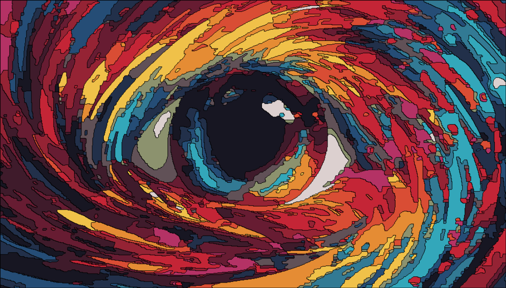
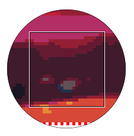

# Image segmentation and labeling
### Low-Mid level Computer Vision appliance using Javascript

> This project represents a fundamental application of image processing in Computer Vision through the utilization of Javascript. The resultant image may not achieve perfection when compared to the outcomes produced by more sophisticated libraries, owing to the constraints of the algorithm and the language. Nevertheless, it serves as an excellent introduction for novices seeking to grasp the fundamental principles of image processing in Computer Vision.

| | Original image | Processed image | Processed image (labeled) |
| --- | --- | --- | --- |
| Image |  |   |   |

## Table of contents
- [Introduction](#introduction)
- [Step-by-step implementation](#step-by-step-implementation)
- [Unsuccessful attempts](#unsuccessful-attempts)
- [Limitation](#limitation)
- [References](#references)
- [Notes when using the web app](#notes-when-using-the-web-app)
- [Conlusion](#conclusion)
- [Demonstration](#demonstration)

## 1. Introduction

- The primary objective of this project is to create a web application that can transform an image into a simplified version with a restricted color palette. This transformation not only improves the visual aesthetics of the image but also enhances its interactivity for users.

- The web app simplify a series of sophisticated image processing algorithms, implemented using HTML, CSS, and JavaScript. The app allows user to upload an image, specify the process's settings, and view the processed image in real-time. The app also provides an option to download the processed image for further use.

-  This report will guide you through the entire process of developing the web application, starting from grasping the fundamental principles of image processing to implementing the algorithms and producing the final result. Furthermore, we will also take a look at some unsuccessful attempts and discuss the limitations of the current implementation.

## 2. Step-by-step implementation
### 2.1. K-means clustering for color reduction

- In our implementation, we utilize the K-means clustering algorithm to categorize the predominant colors in the image, which are expressed in the RGB format, into a predetermined number of clusters. Each pixel is represented as a vector `[R, G, B]` within the `RGB color space`, where R, G, B correspond to the red, green, and blue color components, respectively. This approach allows us to effectively segment the image by grouping pixels with similar color characteristics into the same cluster.

    

- The process of color reduction using K-means consists of the following steps:
    + **Resize the image**: In case the image is too large, we resize it to a more manageable size to improve processing speed. This step is optional and can be skipped if the image is already of an appropriate size. 

    + **Retrieve pixel data from canvas**: We convert the image data from a `Uint8ClampedArray` to a 2D array of pixel vectors [R, G, B]. This conversion allows us to manipulate the pixel data more easily during the clustering process.

        ```javascript
        uint8ClampedArray = [R1, G1, B1, A1, R2, G2, B2, A2, ...]
        dimensionalArray = [[R1, G1, B1], [R2, G2, B2], ...]
        ```

    + **Initialize centroids**: We randomly select `k` centroids from the pixel vectors in the image. These centroids represent the initial cluster centers for the K-means algorithm. The randomness of the centroid selection can be controlled by setting a seed value for the random number generator.

        ```javascript
        // Make a predictable pseudorandom number generator.
        const prng = new Math.seedrandom('hello.');
        console.log(prng());                // Always 0.9282578795792454
        console.log(prng());                // Always 0.3752569768646784
        ```

        We use `pseudo-random number generator (PRNG)` to ensure that the centroids are initialized consistently across multiple runs of the algorithm.

    + **Assign pixels to clusters**: For each pixel in the image, we calculate the `Euclidean distance` between the pixel vector and each centroid. The pixel is then assigned to the cluster corresponding to the nearest centroid.

    + **Update centroids**: After assigning all pixels to clusters, we recalculate the centroids by taking the mean of all pixel vectors in each cluster. These new centroids represent the updated cluster centers.

    + **Repeat**: Steps 4 and 5 are repeated until the centroids no longer change significantly or a predefined number of iterations is reached. This iterative process allows the algorithm to converge to a stable set of centroids.

    + **Return clustered dataset**: Once the algorithm converges, we receive the dataset which includes a list of centroids and the pixels assigned to each cluster.

        

### 2.2. Median filtering for noise reduction

- In addition to color reduction, we apply a median filtering technique to reduce noise in the image. Noise can manifest as random variations in pixel intensity caused by factors such as sensor limitations, compression artifacts, or environmental conditions. Median filtering is a non-linear filtering method that replaces each pixel's intensity value with the median value of its neighboring pixels. This process helps to smooth out irregularities in the image before `particle removal` process.

- The median filtering process involves the following steps:
    + **Define a filter window**: We define a square filter window of size `n x n` centered around each pixel in the image. The window size `n` determines the number of neighboring pixels considered for calculating the median value.

    + **Calculate the median value**: For each pixel in the image, we sort the Euclidean distances of the pixel values within the filter window and select the median value as the new color for the pixel.

        

    + **Apply the filter**: We repeat this process for all pixels in the image, updating each pixel's color value based on the median of its neighboring pixels.

    + **Return the filtered image**: The resulting image is smoother and less affected by noise, making it easier to identify distinct regions and features in the image.

### 2.3. Particle removal and region merging

- After applying color reduction and noise reduction techniques, we perform particle removal and region merging to further simplify the image and enhance its visual clarity. Particle removal involves eliminating small clusters of pixels that do not contribute significantly to the overall image content. These particles may represent noise, artifacts, or minor details that are not essential for the image's interpretation.

- The partical removal process consists of the following steps:
    + **Define a threshold value**: The value determines the maximum number of pixels allowed in a cluster. Clusters with fewer pixels than the threshold are considered particles and are removed from the image (i.e., merged with their major neighbours).

    + **Identify particles**: By applying `Flood fill` algorithm, we identify clusters of pixels and mark them for removal. The visited pixels are then grouped by row and sorted by column to determine the cluster's boundaries.

        > Flood fill algorithm is a recursive algorithm that is used to visit all the pixels of a region. It starts at a seed pixel and visits all the pixels in 4-connected neighborhood of the seed pixel that have the same color as the seed pixel. The algorithm stops when it reaches the boundary of the region or when the number of visited pixels exceeds the threshold value.

        The neigbours, in our algorithm, are determined the `Moore-neigborhood` (8-connectivity) of the boundaries (excluding the particle's pixels). The algorithm will merge the particle with the neighbour that has the most common color with the particle. In case the neigbour has the same color with the particle, there will be no merging (this usually happens when the cluster is a part of a large region).

        

        > Assume that this region has more pixels than the threshold value, but it is not a standalone region, it is a part of a larger region. In this case, the region will not be removed.
    
    + **Remove particles**: Once the particles are identified, we merge them with their neighboring clusters by updating the pixel's color values to match the majority color in the neighboring cluster.

        | | Before particle removal | After particle removal |
        | --- | --- | --- |
        | Zoom |  |  |

- The narrow region merging process involves combining adjacent regions that are separated by a narrow boundary. This process involes the following steps:
    + **Define a narrow region threshold**: The threshold value determines the maximum width of the boundary between two adjacent regions that can be merged. Regions separated by a boundary narrower than the threshold are considered part of the same region and are merged together.

    + **Identify narrow regions**: We only consider the boundaries between two regions that are large enough (i.e., not particles). By comparing the color of the neighboring regions, we identify narrow boundaries that can be merged.

    + **Merge narrow regions**: We merge the narrow boundaries by updating the pixel values along the boundary to match the majority color of the adjacent regions.

        | | Before merging | After merging |
        | --- | --- | --- |
        | Zoom |  |  | 

        Sometimes, the region has serveral narrow boundaries with complicated shapes. In those cases, the algorithm will sequentially merge the narrow boundaries until there is no more narrow boundary to merge or the number of iterations exceeds the predefined value.

        | | Before merging | After merging |
        | --- | --- | --- |
        | Zoom |  |  |

- Iterating through every region and applying the particle removal and narrow region merging processes, sometimes we accidentally create new particles. To solve this problem, we repeat the process on certain regions until there is no more particle created or the number of iterations exceeds the predefined value.

    > Due to the limitation of the algorithm, some regions may not be merged correctly (i.e, the original polygon may not be preserved), leading to the mutation of the original image. This issue can be addressed by using more advanced image processing techniques.

### 2.4. Region labeling

- After simplifying the image through color reduction, noise reduction, particle removal, and narrow region merging, we perform region labeling to assign a unique label to each distinct region in the image. This process requires identifying a appropriate point inside each region (polygon) to put the label.

- The region labeling process involves the following steps:

    + **Isolate color regions**: For each color cluster in the image, we create a binary mask where the pixels belonging to the cluster (foreground) are set to 1 and all other pixels (background) are set to 0. This mask allows us to analyze each color region more effectively.

        > Background color is black [0, 0, 0] by default. However, if the image has a black color, we will choose another semi-black color, which is not the same as any color in the image, as the background color.

    + **Label connected components**: We apply the `Two-pass Connected-component labeling` algorithm (also known as the `Hoshen–Kopelman` algorithm) to identify connected components in the binary mask. The algorithm makes two passes over the image: the first pass to assign temporary labels and record equivalences, and the second pass to replace each temporary label by the smallest label of its equivalence class.

        | | First pass | Second pass |
        | --- | --- | --- |
        | Image |  |  |

        > Our implementation uses 4-connectivity to determine the connected components. Therefore, every pixel in first pass is checked with its left and top neighbors only.
    
    + **Extract inner and outer boundaries**: For each connected component, we extract the inner and outer boundaries of the polygon in clockwise direction, which means the coordinates must be set along the path of the contour. This forms a `GeoJSON format` object that is used for further calculation.
    
        `Moore-neighbor tracing` algorithm extracts the contour by going around the pattern in a clockwise direction. Every time you reach a foreground pixel, go back to the previously visited pixel and traverse around the current pixel in its Moore neighborhood. Repeat this process until you reach the starting pixel the second time. 

        > Inner boundary extraction is done by reversing the mask (ignoring the exterior of the polygon) and applying the same algorithm as the outer boundary extraction.

        

    + **Identify "center"**: The most straightforward approach is to calculate the centroid of the region (polygon) by averaging the `x` and `y` coordinates of all pixels within the region. This method works well for convex regions but may not be suitable for concave or irregularly shaped regions.
    
        

        A more advanced approach is to find the `Pole of Inaccessibility (POI)` of the region, which is the point furthest from the region's boundary. This point is less sensitive to irregular shapes and provides a more accurate representation of the region's center. In our implementation, we apply `Quadtree partioning` to find this pole. 

        

        This is an iterative grid-based algorithm, which starts by covering the polygon with big square cells and then iteratively splitting them in the order of the most promising ones, while aggressively pruning uninteresting cells.

        + Generate initial square cells that fully cover the polygon (with cell size equal to either width or height, whichever is lower). Calculate distance from the center of each cell to the outer polygon, using negative value if the point is outside the polygon (detected by ray-casting).

        + Put the cells into a `priority queue` sorted by the maximum potential distance from a point inside a cell, defined as a sum of the distance from the center and the cell radius `(equal to cell_size * sqrt(2) / 2)`.

        + Calculate the distance from the centroid of the polygon and pick it as the first "best so far".

        + Pull out cells from the priority queue one by one. If a cell's distance is better than the current best, save it as such. Then, if the cell potentially contains a better solution that the current best `(cell_max - best_dist > precision)`, split it into 4 children cells and put them in the queue.

        + Stop the algorithm when we have exhausted the queue and return the best cell's center as the pole of inaccessibility. It will be guaranteed to be a global optimum within the given precision.
    
    + **Assign labels**: We assign a unique label to each region based on the POI's coordinates.

### 2.5. Edge detection

- In addition to region labeling, we apply edge detection to highlight the boundaries between different regions in the image. Since the image has been simplified, there is no need to calculate the gradient of the image. Instead, we can easily identify the edges by comparing the color values of adjacent pixels.

    | | Filled image | Unfilled image |
    | --- | --- | --- |
    | Image |  |  |

## 3. Unsuccessful attempts
### 3.1. Removing particles using morphological operations

- Initially, we attempted to remove particles using `morphological operations` such as `opening` and `closing`. These operations involve applying a series of dilation and erosion operations to the image to remove small particles and fill in gaps between regions.

    

- Since our image is color-based, we tried to convert it to grayscale before applying morphological operations. This approach was not effective as it did not preserve the color information needed for accurate particle removal.

- In the end, we found that morphological operations were not effective in our project because they cannot control the size of the particles being removed. This led to the missed removal of some particles and the merging of regions that should remain separate.

### 3.2. Merging regions using watershed algorithm

- We also experimented with the `watershed algorithm` to merge narrow regions in the image. The watershed algorithm is a segmentation technique that treats the image as a topographic surface and simulates flooding to identify regions separated by ridges or boundaries.

    

- While the watershed algorithm was effective in merging narrow regions, it also introduced new artifacts and inaccuracies in the image. The algorithm's sensitivity to initial conditions and the complexity of the image made it challenging to achieve consistent and accurate results.

### 3.3. Merging the entire large region instead of splitting them into smaller ones

- In the region labeling process, we initially attempted to merge the entire large region instead of splitting it into smaller regions. This approach led to generation of new particles and inaccuracies in the labeling process. Moreover, the merging process was computationally expensive since the recursive algorithm might cause stack overflow for large regions.

- To address this issue, we modified the algorithm to split the large region into smaller regions and repeatedly checking for narrow boundaries until the entire region is merged correctly.

### 3.4. Applying morphological operations to find boundaries

- We also tried to apply morphological operations to find boundaries between regions in the image. Inner boundary is found by applying `erosion` operation to the binary mask, while outer boundary is found by applying `dilation` operation.

    

- Even so, the captured boundary's coordinates were not ordered like GeoJSON format, which made it difficult to extract the polygon's contour.

### 3.5. Using clockwise sorting to sort the boundary

- We attempted to sort the captured boundary's coordinates in clockwise direction by calculating the angle between each point and the centroid of the region. This approach was not effective as it did not account for concave regions or irregular shapes.

### 3.6. Extracting boundary using Theo Pavlidis algorithm

- Like in the Square Tracing algorithm, the most important thing in Pavlidis' algorithm is your "sense of direction". he left and right turns we make are with respect to your current positioning, which depends on the way you entered the pixel you are standing on.

- Nonetheless, the algorithm did not "guess" the correct direction to go when facing a large region with multiple narrow boundaries. This led to inaccuracies in the boundary extraction process and even caused the algorithm to get stuck in a loop.

### 3.7. Calculating the centroid using formula

- As mentioned earlier, calculating the centroid of a region by averaging the `x` and `y` coordinates of all pixels within the region may not be suitable for concave or irregularly shaped regions. This approach led to inaccuracies in the labeling process and misplacement of labels.

## 4. Limitation

- The current implementation of the image segmentation and labeling process has several limitations that may affect the accuracy and efficiency of the results. Some of the key limitations include:

    + **Color-based segmentation**: The image segmentation process relies on color information to identify distinct regions. This approach may not be suitable for grayscale images or images with subtle color variations.

    + **Sensitivity to noise**: The image processing algorithms are sensitive to noise and artifacts in the image, which can affect the accuracy of the segmentation and labeling process. Noise reduction techniques are applied to mitigate this issue, but they may not be effective in all cases.

    + **Complex shapes and boundaries**: The algorithms may struggle to accurately segment regions with complex shapes or irregular boundaries. This can lead to inaccuracies in the labeling process and misplacement of labels.

    + **Computational complexity**: The image processing algorithms involve multiple iterative steps and calculations, which can be memory inefficient. Optimizing the algorithms for speed and efficiency is an ongoing challenge.

    + **Limited feature extraction**: The current implementation focuses on color-based segmentation and labeling, which may not capture all relevant features in the image. Additional feature extraction techniques could be explored to enhance the image analysis process.

    + **Algorithmic limitations**: The algorithms used in the image processing pipeline have inherent limitations that may affect the quality of the results. For example, the K-means clustering algorithm may struggle with non-linearly separable data, while the region labeling algorithm may not handle concave regions effectively.

## 5. References

- [RGB color space](https://en.wikipedia.org/wiki/RGB_color_space)
- [Pixel manipulation with Canvas API](https://developer.mozilla.org/en-US/docs/Web/API/Canvas_API/Tutorial/Pixel_manipulation_with_canvas)
- [Pseudo-random number generator](https://en.wikipedia.org/wiki/Pseudorandom_number_generator)
- [Euclidean distance](https://en.wikipedia.org/wiki/Euclidean_distance)
- [K-means clustering algorithm](https://en.wikipedia.org/wiki/K-means_clustering)
- [Median filtering](https://en.wikipedia.org/wiki/Median_filter)
- [Moore-neighborhood](https://en.wikipedia.org/wiki/Moore_neighborhood)
- [Flood fill algorithm](https://en.wikipedia.org/wiki/Flood_fill)
- [Morphological operations](https://en.wikipedia.org/wiki/Mathematical_morphology)
- [Watershed algorithm](https://en.wikipedia.org/wiki/Watershed_(image_processing))
- [Pixel connectivity](https://en.wikipedia.org/wiki/Pixel_connectivity)
- [Connected-component labeling](https://en.wikipedia.org/wiki/Connected-component_labeling)
- [Hoshen–Kopelman algorithm](https://en.wikipedia.org/wiki/Hoshen%E2%80%93Kopelman_algorithm)
- [GeoJSON format for poylgon](https://geojson.org/geojson-spec.html)
- [Theo Pavlidis algorithm](https://en.wikipedia.org/wiki/Theo_Pavlidis_algorithm)
- [Moore-neighbor tracing](https://www.imageprocessingplace.com/downloads_V3/root_downloads/tutorials/contour_tracing_Abeer_George_Ghuneim/moore.html)
- [Quadtree partitioning](https://en.wikipedia.org/wiki/Quadtree)
- [Pole of inaccessibility](https://en.wikipedia.org/wiki/Pole_of_inaccessibility)
- [Finding the center of a polygon](https://blog.mapbox.com/a-new-algorithm-for-finding-a-visual-center-of-a-polygon-7c77e6492fbc)
- [Binary image](https://en.wikipedia.org/wiki/Binary_image)
- [Edge detection](https://en.wikipedia.org/wiki/Edge_detection)

## 6. Notes when using the web app

- Since Javascript is a single-threaded language, the implementation of backend causes the user interface not to be responsive during the processing time. Therefore, we used asynchronous functions by applying "sleep" (1ms) for some long-running algorithms to make the image processing as smooth as possible. However, this may cause the animation to pause when the tab is not visible. So, it is recommended to keep the tab focused during the processing time.

- The web app has not been built to be responsive on several devices. Therefore, it is recommended to use the app on a desktop or laptop for the best experience. Try to zoom out the browser if the layout is not displayed correctly.

- The web app may not work correctly on some browsers due to the compatibility of the HTML5 Canvas API. It is recommended to use the latest version of Google Chrome for the best experience.

## 7. Conclusion

- In conclusion, the image segmentation and labeling process is a complex and multi-faceted task that involves a series of sophisticated algorithms and techniques. By combining color reduction, noise reduction, particle removal, region merging, region labeling, and edge detection, we can simplify an image and enhance its visual clarity.

- Special thanks to the author of the algorithms used in this project, as well as the online resources and tutorials that helped us understand the foundational concepts of image processing in Computer Vision. 

- We also give a big shoutout to ChatGPT for supporting us on code suggestions, color-by-number pictures for inspiring us to create this project, and Gemini for helping nothing but messing up the code.

## 8. Demonstration

- Youtube video: [https://youtu.be/bq-ItJV3dMY
](https://youtu.be/bq-ItJV3dMY)
